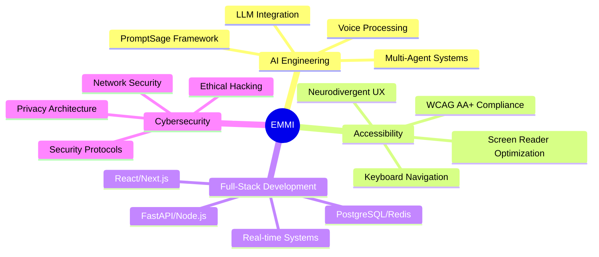

# 🎮 GitHub Space Shooter

---

# 👋 Hey, I'm Emanuel (EMMI)

### 🧠 AI Engineer | 🎯 Neurodivergent Tech Innovator | 🔐 Cybersecurity Student

**Engaging Minds, Merging Ideas**

---

## 🚀 What I Do

> **Building accessible AI solutions that actually work for neurodivergent minds**

I create **AI-powered educational platforms** and **intelligent systems** that prioritize:
- ✨ **Accessibility first** - WCAG AA+ compliance, neurodivergent-optimized UX
- 🔒 **Privacy by design** - Local processing, GDPR compliant, your data stays yours
- 🌍 **Real-world impact** - Climate action, education equity, community empowerment

---

## 🏆 Recognition

<table>
<tr>
<td align="center">🥇 <b>EU GREEN Innovation Days 2025</b> Winner</td>
<td align="center">🏅 <b>Irish Enterprise Awards</b> Best Accessible EdTech 2026</td>
<td align="center">🌟 <b>Irish Enterprise Awards</b> Ethical AI Excellence 2026</td>
</tr>
<tr>
<td align="center">🏆 <b>TechIreland AI Challenge</b> Finalist 2025 (MedicSage)</td>
<td align="center">⭐ <b>AI Awards Ireland</b> 2 Nominations (2025)</td>
<td align="center">🎖️ <b>Student Senator</b> Award 2024/2025</td>
</tr>
</table>

---

## 💡 Featured Projects

### 🎓 [NeuroBridgeEDU](https://neurobridgeedu.eu)
**Award-winning AI-EdTech Platform**
- 🧩 Neurodivergent-adaptive content delivery
- 💰 90% cost reduction vs cloud-based solutions
- 🌐 Multilingual support (24+ languages)
- 🔐 100% privacy-first architecture

### 🤖 [PromptSage Framework](https://promptsage.cloud)
**XML-Structured Prompt Engineering**
- 📐 Superior AI behavior control & consistency
- 🎯 Structured XML-based prompt architecture
- 🔄 Multi-agent system optimization
- 📊 Proven in production environments

### 🌱 [GreenCeltAI](https://greencelt.emmi.zone)
**Irish Environmental Research Assistant**
- 🔬 Multi-agent research system
- 🇮🇪 Ireland-specific environmental data
- 📈 EU policy analysis & compliance
- 🌿 Climate action intelligence

### ⚡ [ElectroSage Academy](https://electrosage.emmi.zone)
**AI-Powered Electrical Engineering Learning**
- 🎨 14 interactive visualizations
- 🎙️ AI Socratic tutoring with voice input
- 📚 Comprehensive curriculum (9 sections)
- ♿ Full accessibility features

### 🏥 [MedicSage](https://medicsage.eu)
**Multi-Agent Medical Care System**
- 🤖 AI-powered diagnostic assistance
- 🔬 Multi-agent collaborative approach
- 🏆 TechIreland National AI Challenge Finalist 2025
- 🔒 Privacy-first medical intelligence

### 🏰 [LeitrimWay](https://leitrimway.ie)
**Tourism & Community Platform**
- 🗺️ Interactive tourism experiences
- 📍 Local business directory
- 🌄 Cultural heritage showcase
- 📱 Mobile-optimized exploration

### ⚡ [FlowForge](https://flowforge.emmi.zone)
**Workflow Automation Platform**
- 🔄 Process automation tools
- 🎯 Efficiency optimization
- 🔗 System integrations
- 📊 Analytics & insights

### 🌍 Other Notable Projects
- **[TEEC](https://teec.click)** - Tech Education & Community Hub
- **[Verdana](https://verdana.emmi.zone)** - EU Green Policies AI Assistant

---

## 🛠️ Tech Stack

### **Languages & Frameworks**

### **AI & Machine Learning**

### **Databases & Infrastructure**

### **Developer Tools**

---

## 🎯 Core Expertise

---

## 🧩 My Neurodivergent Superpower

**ADHD + Dyslexia = Innovation Catalyst**

I don't just build for neurodivergent users—I **am** a neurodivergent builder. This lived experience drives:
- 🎨 **Visual-first design** - Scannable layouts, clear hierarchy
- ⚡ **Quick cognitive load reduction** - Chunked information, progressive disclosure
- 🎯 **Focus optimization** - Distraction-free interfaces, keyboard shortcuts
- 💬 **Multiple input modes** - Text, voice, visual—whatever works best

*"Neurodivergence isn't a limitation—it's a different operating system with unique advantages."*

---

## 🎓 Current Focus

**BSc Computer Networks & Cybersecurity** @ Atlantic Technological University (2023-2027)
- 🔐 Network architecture & security protocols
- 🛡️ Ethical hacking & penetration testing
- 🌐 Systems administration & infrastructure
- 📊 Data privacy & GDPR compliance

---

## 📈 GitHub Stats

---

## 🌍 Philosophy

> **"Gratitude is the best attitude"**

Post-accident consciousness shift (2016) transformed my relationship with:
- ⏰ **Time** - Every moment matters
- 🤝 **Connection** - We're all part of the quantum dance
- 🧘 **Presence** - Scientific mediator balancing analysis + empathy
- 💫 **Purpose** - Technology that serves humanity

---

## 🤝 Let's Connect!

I'm always interested in:
- 🚀 **Collaborative AI projects** focused on accessibility
- 🌱 **Climate tech** and environmental solutions
- 🧠 **Neurodivergent-centered** design discussions
- 🔒 **Privacy-first** architecture patterns
- 📚 **Open-source contributions** that matter

### 📫 Reach Out

- 🌐 **Website:** [emmi.zone](https://emmi.zone)
- 📝 **Blog:** [blog.emmi.zone](https://blog.emmi.zone)
- 💼 **LinkedIn:** [linkedin.com/in/emmic](https://www.linkedin.com/in/emmic/)
- 📧 **Email:** [Contact via website](https://emmi.zone)

---

### 💫 "Engaging Minds, Merging Ideas"

*Building the future of accessible AI, one commit at a time*

