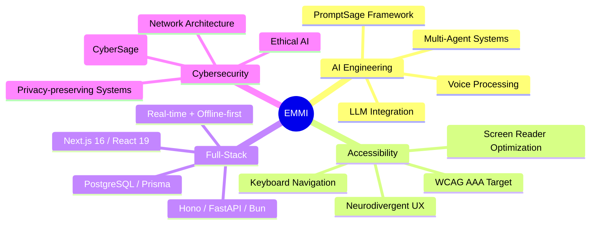

<!-- ───────────────────────── HERO ───────────────────────── -->

# Emanuel Covasa &nbsp;·&nbsp; **EMMI**

<samp>Founder · [NeuroBridge AI Labs](https://neurobridgeedu.eu) &nbsp;·&nbsp; Full-stack · AI · Cybersecurity &nbsp;·&nbsp; County Leitrim, Ireland</samp>

  
  
  

---

## ▸ &nbsp; Contribution Space Shooter

Commits as asteroids · merges as power-ups · the longer the streak, the brighter the weapons.

---

## ▸ &nbsp; Activity

<!-- 31-day contribution activity graph — visual, theme-matched, auto-refreshed -->

  

<!-- Dynamic contribution counter — queries GraphQL via shields.io endpoint, refreshed every 6h by metrics.yml workflow -->

  

<!-- Lightweight stats — commits card hidden because public widget can only see public repos (207/~2,126 = misleading) -->

<!--
  Auto-updated every 6 hours by .github/workflows/metrics.yml (full metrics.svg).
  Disabled until METRICS_TOKEN secret is configured (see workflow header).
  Re-enable by uncommenting once the first workflow run succeeds:

-->

---

## ▸ &nbsp; Recognition

<table>
  <tr>
    <td align="center" width="220"><b>EU GREEN Innovation Days</b> Winner · 2025</td>
    <td align="center" width="220"><b>Irish Enterprise Awards</b> Best Accessible EdTech · 2026</td>
    <td align="center" width="220"><b>Irish Enterprise Awards</b> Ethical AI Excellence · 2026</td>
  </tr>
  <tr>
    <td align="center"><b>TechIreland AI Challenge</b> Finalist · 2025 (MedicSage)</td>
    <td align="center"><b>AI Awards Ireland</b> 2 Nominations · 2025</td>
    <td align="center"><b>ATUSU</b> Senator 2024/25 · Advocate 2026</td>
  </tr>
</table>

---

## ▸ &nbsp; Featured Projects

<table>
  <tr>
    <td width="33%" valign="top">
      <h3 align="center">NeuroBridgeEDU</h3>
      
Award-winning AI-EdTech · flagship

      
Neurodivergent-adaptive content delivery · 90% cost reduction vs cloud · 33 languages incl. Gaeilge · 100% privacy-first.

      

    </td>
    <td width="33%" valign="top">
      <h3 align="center">TaskSage</h3>
      
AI task intelligence · new

      
Neurodivergent-first task manager with an AI collaborator (Sage). PWA, offline-capable, Next.js 16 + Hono.

      

    </td>
    <td width="33%" valign="top">
      <h3 align="center">CyberSage</h3>
      
AI pentesting platform · new

      
AI-augmented offensive-security workbench. Kali VM orchestration, scoped assessments, report generation.

      

    </td>
  </tr>
  <tr>
    <td width="33%" valign="top">
      <h3 align="center">PromptSage</h3>
      
XML-structured prompt framework

      
Superior AI behaviour control · structured XML prompt architecture · multi-agent optimisation · production-proven.

      

    </td>
    <td width="33%" valign="top">
      <h3 align="center">MedicSage</h3>
      
Multi-agent healthcare AI

      
Collaborative AI agents for medical decision support · TechIreland Finalist 2025 · privacy-preserving architecture.

      

    </td>
    <td width="33%" valign="top">
      <h3 align="center">ElectroSage Academy</h3>
      
AI learning for electrical engineering

      
14 interactive visualisations · AI Socratic tutoring with voice · 9 sections · full accessibility.

      

    </td>
  </tr>
  <tr>
    <td width="33%" valign="top">
      <h3 align="center">GreenCeltAI</h3>
      
Irish environmental research AI

      
Multi-agent research system · Ireland-specific data · EU policy analysis · climate-action intelligence.

      

    </td>
    <td width="33%" valign="top">
      <h3 align="center">LeitrimWay</h3>
      
Tourism & community

      
Interactive tourism experiences · local business directory · cultural heritage · mobile-optimised.

      

    </td>
    <td width="33%" valign="top">
      <h3 align="center">TimeSage</h3>
      
Privacy-first time tracking · <i>formerly FlowForge</i>

      
100% local storage · floating timer · Pomodoro · offline PDF invoicing · ADHD/dyslexia-optimised UI.

      

    </td>
  </tr>
  <tr>
    <td colspan="3" align="center" valign="top">
      <h3 align="center">TEEC.click &nbsp;—&nbsp; The Ephemeral Event Connector</h3>
      
Privacy-first ephemeral social networking for in-person events · 3km radius · auto-delete 3–24h · zero PII · Cloudflare Turnstile · cyberpunk UI with neon aesthetics.

      

    </td>
  </tr>
</table>

---

## ▸ &nbsp; Tech Stack

<b>LANGUAGES · FRAMEWORKS</b>

<b>AI · ML</b>

<b>DATA · INFRA</b>

<b>TOOLS</b>

---

## ▸ &nbsp; Core Expertise

```mermaid
mindmap
  root((EMMI))
    AI Engineering
      Multi-Agent Systems
      PromptSage Framework
      LLM Integration
      Voice Processing
    Accessibility
      WCAG AAA Target
      Neurodivergent UX
      Screen Reader Optimization
      Keyboard Navigation
    Full-Stack
      Next.js 16 / React 19
      Hono / FastAPI / Bun
      PostgreSQL / Prisma
      Real-time + Offline-first
    Cybersecurity
      Offensive Security (CyberSage)
      Network Architecture
      Privacy-preserving Systems
      Ethical AI
```

---

## ▸ &nbsp; Neurodivergent Superpower

**ADHD + Dyslexia = innovation catalyst.**

I don't just build for neurodivergent users — I *am* a neurodivergent builder. This lived experience drives:

- **Visual-first design** — scannable layouts, clear hierarchy
- **Cognitive-load reduction** — chunked information, progressive disclosure
- **Focus optimisation** — distraction-free interfaces, keyboard shortcuts
- **Multiple input modes** — text, voice, visual — whatever works best

> *Neurodivergence isn't a limitation — it's a different operating system with unique advantages.*

---

## ▸ &nbsp; Current Focus

<table>
<tr>
<td width="50%" valign="top">

**BSc Computer Networks & Cybersecurity**
Atlantic Technological University · 2023–2027

- Network architecture & security protocols
- Ethical hacking & penetration testing
- Data privacy & GDPR compliance
- Infrastructure & systems administration

</td>
<td width="50%" valign="top">

**Philosophy**

Post-accident consciousness shift (2016). Time isn't linear — it's an ocean we swim through.

- *Every moment matters*
- *Scientific mediator — analysis + empathy*
- *Technology that serves humanity*

> *Gratitude is the best attitude.*

</td>
</tr>
</table>

---

## ▸ &nbsp; Let's Connect

Always interested in:

- Collaborative AI projects focused on **accessibility**
- **Climate-tech** and environmental systems
- **Neurodivergent-centred** design
- **Privacy-first** architecture
- **Open-source** contributions that matter

[&nbsp;emmi.zone&nbsp;](https://emmi.zone) &nbsp;·&nbsp; [&nbsp;blog.emmi.zone&nbsp;](https://blog.emmi.zone) &nbsp;·&nbsp; [&nbsp;linkedin.com/in/emmic&nbsp;](https://www.linkedin.com/in/emmic/) &nbsp;·&nbsp; [&nbsp;contact via website&nbsp;](https://emmi.zone)

---

 

<i>Engaging Minds — Merging Ideas</i>

