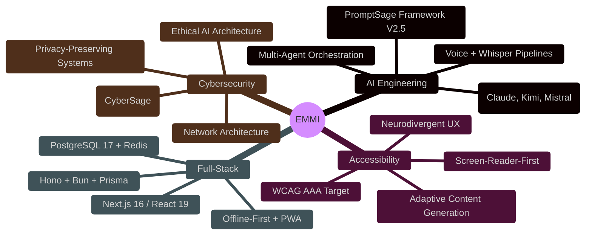

<div align="center">

<!-- ═══════════════════════════════════════════════════════════════════════
     EMANUEL COVASA · EMMI · NEUROBRIDGE AI LABS
     Terminal-Command-Center profile · v3.0 · 2026-05-11
     ═══════════════════════════════════════════════════════════════════════ -->


<br /><br />

<a href="https://neurobridgelabs.com"></a>
<a href="https://emmi.zone"></a>
<a href="https://blog.emmi.zone"></a>
<a href="https://www.linkedin.com/in/emmic/"></a>

<br />

<sub><code>founder · CTO · cybersecurity student @ ATU Sligo · 5 awards in 2026</code></sub>

</div>

<br />

```
╾──────────────────────────────────────────────────────────────────────────╼
   ▸ CONTRIBUTION SPACE SHOOTER · live mission log
╾──────────────────────────────────────────────────────────────────────────╼
```

<div align="center">


<sub><i>commits as asteroids · merges as power-ups · the streak fuels the cannons</i></sub>

</div>

<br />

```
╾──────────────────────────────────────────────────────────────────────────╼
   ▸ ACTIVITY · last 6 months, refreshed every 6h
╾──────────────────────────────────────────────────────────────────────────╼
```

<div align="center">


<br /><br />


&nbsp;


<br /><br />

<a href="https://github.com/EmminiX">
  
  
</a>

<br /><br />

<!-- Rich metrics, auto-refreshed every 6h by .github/workflows/metrics.yml -->


</div>

<br />

```
╾──────────────────────────────────────────────────────────────────────────╼
   ▸ NEUROBRIDGE AI LABS · parent company, two product lines
╾──────────────────────────────────────────────────────────────────────────╼
```

<div align="center">

<table>
<tr>
<td colspan="2" align="center">

### <a href="https://neurobridgelabs.com"></a>

<sub>Privacy-first AI for institutions. On-device capture, on-premises adaptation, zero data leaves the building.</sub>

</td>
</tr>
<tr>
<td width="50%" valign="top" align="center">

<h4>🎓 <a href="https://neurobridgeedu.eu">NeuroBridgeEDU</a></h4>
<sub><b>first product · education vertical · live</b></sub>

<p align="left"><sub>
Privacy-first transcription + adaptive-summary platform. Captures lectures on-device, produces a different summary for each recipient profile (dyslexia, ADHD, language level, role). 33 languages including Gaeilge. Tauri 2 + Rust + Next.js. EU models (Mistral, EuroLLM).
</sub></p>

<p align="left"><sub>
<b>Built end-to-end for €500–€800 total</b>, entirely on Claude Code + custom EMMI-AI scaffolding. Pro tier €10.99/mo.
</sub></p>

<a href="https://neurobridgeedu.eu"></a>

</td>
<td width="50%" valign="top" align="center">

<h4>♿ NeuroBridge Adapt</h4>
<sub><b>accessibility vertical · forthcoming</b></sub>

<p align="left"><sub>
Second product line. The same on-device adaptation engine, retargeted at workplaces and public services: produce a version of any document, page, or stream that matches the recipient's cognitive profile. Built so a single source can serve dyslexic readers, ADHD readers, second-language readers, and screen-reader users from one ingestion pipeline.
</sub></p>

<a href="https://neurobridgelabs.com"></a>

</td>
</tr>
</table>

</div>

<br />

```
╾──────────────────────────────────────────────────────────────────────────╼
   ▸ FLAGSHIP STACK · the rest of the portfolio
╾──────────────────────────────────────────────────────────────────────────╼
```

<div align="center">

<table>
  <tr>
    <td width="33%" valign="top">
      <h4 align="center">🧠 EMMI-AI</h4>
      <p align="center"><sub><b>personal AI orchestration</b></sub></p>
      <p align="left"><sub>
        PAI v7.0 runtime with SAGE engine, ENGRAM memory, PULSE statusline, PromptSage framework V2.5. The system that lets one person run as a tech company. Spawns specialist agent crews (Kimi, Copilot, Codex, Claude) and conducts them in parallel. 15 PRs merged across 6 codebases in 4.5h on its last orchestration run.
      </sub></p>
      <p align="center"><a href="https://emmi.zone"></a></p>
    </td>
    <td width="33%" valign="top">
      <h4 align="center">📋 TaskSage</h4>
      <p align="center"><sub><b>AI-native task + time + life OS</b></sub></p>
      <p align="left"><sub>
        Obsidian-replacement workspace. SageEngine backend (Hono + Bun + Prisma) live. Frontend Next.js 16 PWA being built. Three modules: TaskSage (kanban + AI), TimeSage (time tracking + invoicing, formerly FlowForge), and Sage chatbot (Mistral Small 3 via OpenRouter). Replaces Todoist for neurodivergent operators.
      </sub></p>
      <p align="center"><a href="https://www.tasksage.space"></a></p>
    </td>
    <td width="33%" valign="top">
      <h4 align="center">🔐 CyberSage</h4>
      <p align="center"><sub><b>AI pentesting platform</b></sub></p>
      <p align="left"><sub>
        AI-augmented offensive-security workbench. Kali VM orchestration, scoped assessments, AI-assisted report generation. Currently commercialising. Built alongside the BSc Computer Networks + Cybersecurity at ATU Sligo so theory and product develop together.
      </sub></p>
      <p align="center"><a href="https://cybersage.emmi.engineer"></a></p>
    </td>
  </tr>
  <tr>
    <td width="33%" valign="top">
      <h4 align="center">📡 TEEC.click</h4>
      <p align="center"><sub><b>reusable e-ink badge · physical product</b></sub></p>
      <p align="left"><sub>
        Conference-badge hardware business. Reusable e-ink badge manufactured in County Leitrim. Pairs with an ephemeral-event-connector app: 3km radius, auto-delete in 3–24h, zero PII. Cyberpunk UI. EUR 1M+ grant strategy in motion.
      </sub></p>
      <p align="center"><a href="https://teec.click"></a></p>
    </td>
    <td width="33%" valign="top">
      <h4 align="center">🛠️ The Workbench</h4>
      <p align="center"><sub><b>tech community · NW Ireland</b></sub></p>
      <p align="left"><sub>
        Monthly in-person tech meetup launching June 2026 in Northwest Ireland. Builders, students, founders, weirdos. Same energy as the projects on this page: ship things, talk shop, help each other.
      </sub></p>
      <p align="center"><a href="https://theworkbench.ie"></a></p>
    </td>
    <td width="33%" valign="top">
      <h4 align="center">🤖 PromptSage</h4>
      <p align="center"><sub><b>prompt framework, V2.5</b></sub></p>
      <p align="left"><sub>
        The XML-structured prompt-engineering framework EMMI-AI is built on. Seven-layer architecture, immutable identity anchors, sandwich defence, Unicode/emoji injection guardrails. V2.5 shipped April 2026. Used in production across every project on this page.
      </sub></p>
      <p align="center"><a href="https://promptsage.cloud"></a></p>
    </td>
  </tr>
</table>

<details>
<summary><sub><b>more projects ⌄</b></sub></summary>
<br />
<table>
  <tr>
    <td width="33%" valign="top">
      <h4 align="center">⚡ ElectroSage Academy</h4>
      <p align="left"><sub>AI-powered electrical-engineering learning. 14 interactive visualisations, Socratic voice tutoring, 9 curriculum sections, full accessibility.</sub></p>
      <p align="center"><a href="https://electrosage.emmi.zone"></a></p>
    </td>
    <td width="33%" valign="top">
      <h4 align="center">🌱 GreenCeltAI</h4>
      <p align="left"><sub>Multi-agent research system for Irish environmental policy and EU compliance. Climate-action intelligence with Ireland-specific data.</sub></p>
      <p align="center"><a href="https://greencelt.emmi.zone"></a></p>
    </td>
    <td width="33%" valign="top">
      <h4 align="center">🏥 MedicSage</h4>
      <p align="left"><sub>Multi-agent healthcare AI concept. Collaborative AI agents for medical decision support. TechIreland AI Challenge Finalist 2025.</sub></p>
      <p align="center"><a href="https://medicsage.eu"></a></p>
    </td>
  </tr>
  <tr>
    <td width="33%" valign="top">
      <h4 align="center">🏰 LeitrimWay</h4>
      <p align="left"><sub>Tourism and community platform for County Leitrim. Interactive experiences, local directory, cultural heritage, mobile-optimised.</sub></p>
      <p align="center"><a href="https://leitrimway.ie"></a></p>
    </td>
    <td width="33%" valign="top">
      <h4 align="center">⏱️ TimeSage</h4>
      <p align="left"><sub>Privacy-first time tracking and invoicing (formerly FlowForge). 100% local storage, Pomodoro timer, offline PDF invoicing.</sub></p>
      <p align="center"><a href="https://flowforge.emmi.zone"></a></p>
    </td>
    <td width="33%" valign="top">
      <h4 align="center">📰 emmi.zone + blog</h4>
      <p align="left"><sub>Personal site and engineering blog. Where the long-form thinking on neurodivergent building, AI ethics, and consciousness lives.</sub></p>
      <p align="center"><a href="https://blog.emmi.zone"></a></p>
    </td>
  </tr>
</table>
</details>

</div>

<br />

```
╾──────────────────────────────────────────────────────────────────────────╼
   ▸ 2026 SIGNAL · awards, press, recognition
╾──────────────────────────────────────────────────────────────────────────╼
```

<div align="center">

<table>
  <tr>
    <td width="33%" align="center" valign="top">
      <h4>🏆 Irish Enterprise Awards 2026</h4>
      <sub><i>NeuroBridgeEDU</i></sub><br />
      <sub>Best Accessible EdTech</sub>
    </td>
    <td width="33%" align="center" valign="top">
      <h4>🌍 Ethical AI Excellence 2026</h4>
      <sub><i>NeuroBridgeEDU</i></sub><br />
      <sub>For privacy-first architecture</sub>
    </td>
    <td width="33%" align="center" valign="top">
      <h4>🥇 AIB Small Budget Project 2026</h4>
      <sub><i>AMLÉ Student Impact Awards</i></sub><br />
      <sub>Recognised by Bryan O'Mahony</sub>
    </td>
  </tr>
  <tr>
    <td width="33%" align="center" valign="top">
      <h4>🎓 ATUSU Advocate of the Year 2026</h4>
      <sub><i>Atlantic Technological University SU</i></sub>
    </td>
    <td width="33%" align="center" valign="top">
      <h4>🌱 EU GREEN Innovation Days 2025</h4>
      <sub><i>Winner · GreenCeltAI</i></sub>
    </td>
    <td width="33%" align="center" valign="top">
      <h4>📰 Leitrim Observer 2026</h4>
      <sub><i>"A Leitrim man's mission to build a personal AI for everyone"</i></sub><br />
      <sub>Eoin Gallagher, April 2026</sub>
    </td>
  </tr>
</table>

</div>

<br />

```
╾──────────────────────────────────────────────────────────────────────────╼
   ▸ STACK · the tools I actually run, not the ones I admire
╾──────────────────────────────────────────────────────────────────────────╼
```

<div align="center">

<sub><b>LANGUAGES · FRAMEWORKS</b></sub>

<p>


</p>

<sub><b>AI · ORCHESTRATION</b></sub>

<p>


</p>

<sub><b>DATA · INFRA</b></sub>

<p>


</p>

<sub><b>OPS · TOOLING</b></sub>

<p>


</p>

</div>

<br />

```
╾──────────────────────────────────────────────────────────────────────────╼
   ▸ CORE EXPERTISE · how the pieces connect
╾──────────────────────────────────────────────────────────────────────────╼
```


```mermaid
%%{init: {'theme':'dark', 'themeVariables': { 'primaryColor':'#0F172A','primaryTextColor':'#F8FAFC','primaryBorderColor':'#22C55E','lineColor':'#22C55E','secondaryColor':'#B026FF','tertiaryColor':'#0EA5E9'}}}%%
mindmap
  root((EMMI))
    AI Engineering
      Multi-Agent Orchestration
      PromptSage Framework V2.5
      LLM Integration (Claude, Kimi, Mistral)
      Voice + Whisper Pipelines
    Accessibility
      WCAG AAA Target
      Neurodivergent UX
      Adaptive Content Generation
      Screen-Reader-First
    Full-Stack
      Next.js 16 / React 19
      Hono + Bun + Prisma
      PostgreSQL 17 + Redis
      Offline-First + PWA
    Cybersecurity
      Offensive Security (CyberSage)
      Privacy-Preserving Systems
      Network Architecture
      Ethical AI Architecture
```

<br />

```
╾──────────────────────────────────────────────────────────────────────────╼
   ▸ ABOUT · the operator behind the system
╾──────────────────────────────────────────────────────────────────────────╼
```

<table>
<tr>
<td width="50%" valign="top">

<h4>🎓 Currently studying</h4>

<sub><b>BSc Computer Networks + Cybersecurity</b><br />
Atlantic Technological University Sligo · 2023–2027</sub>

<sub>Network architecture, penetration testing, infrastructure, GDPR, privacy-preserving systems. Theory feeds CyberSage in real time.</sub>

<br /><br />

<h4>🧠 Neurodivergent superpower, not deficit</h4>

<sub>Diagnosed dyslexic in 2024, age 39. AuDHD pattern. Reading comprehension 9th percentile, perceptual reasoning 68th percentile. Translation: I do not read in straight lines, I see systems. Every product on this page is designed for the way my own brain works first, then opened up to everyone who shares that wiring.</sub>

<br /><br />

<h4>📍 Based in County Leitrim, Ireland</h4>

<sub>Romanian-born, 20+ years in Ireland. Building from the northwest because the best ideas do not need a postcode.</sub>

</td>
<td width="50%" valign="top">

<h4>👨‍👧‍👦 The why</h4>

<sub><b>Arthur</b> (7) and <b>Maya</b> (4).</sub>

<sub>Everything on this profile, every commit, every late-night fix, every grant application, every award acceptance, lands back here. Build a world that is more accessible, more honest, and more privacy-respecting than the one they were born into. That is the brief.</sub>

<br /><br />

<h4>🌌 Operating philosophy</h4>

<sub><i>Post-2016 accident, the relationship with time changed permanently. Time is not linear, it is an ocean. Past, present, and future swim around us at once. This is not a metaphor for me. It is the lens through which every decision gets made.</i></sub>

<br /><br />

<sub><b>Doctrine:</b></sub>

<sub>· Speed is clarity.<br />
· Technology enhances humanity, never replaces it.<br />
· Scientific mediator: analysis plus empathy.<br />
· Gratitude is the best attitude.</sub>

</td>
</tr>
</table>

<br />

```
╾──────────────────────────────────────────────────────────────────────────╼
   ▸ CONNECT · routes in
╾──────────────────────────────────────────────────────────────────────────╼
```

<div align="center">

Always open to:

<sub>collaborative AI projects focused on <b>accessibility</b> · <b>climate-tech</b> and environmental systems · <b>neurodivergent-centred</b> design · <b>privacy-first</b> architecture · open-source contributions that actually matter</sub>

<br /><br />

<a href="https://neurobridgelabs.com"></a>
<a href="https://emmi.zone"></a>
<a href="https://blog.emmi.zone"></a>
<a href="https://www.linkedin.com/in/emmic/"></a>

<br />

<sub>For business: <a href="https://emmi.zone">contact form on emmi.zone</a></sub>

</div>

<br />

```
╾──────────────────────────────────────────────────────────────────────────╼
                  engaging minds · merging ideas · since 2024
╾──────────────────────────────────────────────────────────────────────────╼
```

<div align="center">
<sub><i>"We are all connected in this quantum dance of consciousness."</i></sub>
</div>
