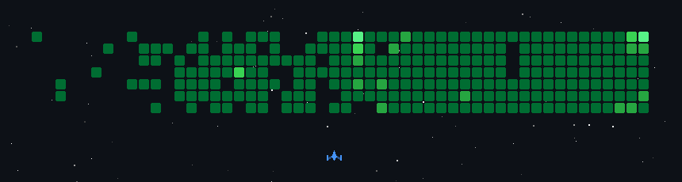
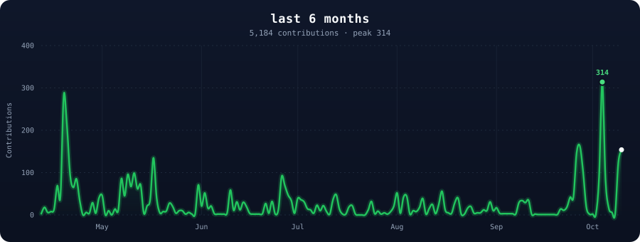
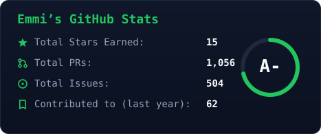
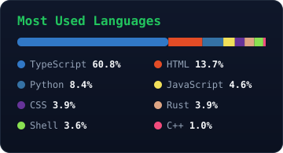

<div align="center">

<!-- ═══════════════════════════════════════════════════════════════════════
     EMANUEL COVASA · EMMI · NEUROBRIDGEEDU
     Terminal-Command-Center profile · v4.0 · 2026-10-05
     ═══════════════════════════════════════════════════════════════════════ -->


<br /><br />

<a href="https://neurobridgeedu.eu"></a>
<a href="https://emmi.zone"></a>
<a href="https://blog.emmi.zone"></a>
<a href="https://www.linkedin.com/in/emmic/"></a>

<br />

<sub><code>founder · NeuroBridgeEDU · Enterprise Ireland New Frontiers · 6 awards in 2026</code></sub>

</div>

<br />

```
╾──────────────────────────────────────────────────────────────────────────╼
   ▸ CONTRIBUTION SPACE SHOOTER · live mission log
╾──────────────────────────────────────────────────────────────────────────╼
```

<div align="center">



<sub><i>commits as asteroids · merges as power-ups · the streak fuels the cannons</i></sub>

</div>

<br />

```
╾──────────────────────────────────────────────────────────────────────────╼
   ▸ ACTIVITY · last 6 months, refreshed every 6h
╾──────────────────────────────────────────────────────────────────────────╼
```

<div align="center">



<br /><br />


&nbsp;


<br /><br />

<a href="https://github.com/EmminiX">
  
  
</a>

<br /><br />

<!-- Rich metrics, auto-refreshed every 6h by .github/workflows/metrics.yml -->


</div>

<br />

```
╾──────────────────────────────────────────────────────────────────────────╼
   ▸ NEUROBRIDGEEDU · the product
╾──────────────────────────────────────────────────────────────────────────╼
```

<div align="center">

<table>
<tr>
<td align="center">

<h4>🎓 <a href="https://neurobridgeedu.eu">NeuroBridgeEDU</a></h4>
<sub><b>privacy-first lecture transcription and adaptive summaries · public release coming soon</b></sub>

<p align="left"><sub>
A desktop app that records a lecture on your own computer, transcribes it, and writes summaries shaped for each student, including dyslexic, ADHD and second-language learners. Local-first, EU-built AI (Mistral, EuroLLM), 32 languages. Tauri 2, Rust and Next.js. Also home of <a href="https://learn.neurobridgeedu.eu">Stillpool</a>, a free AI literacy course.
</sub></p>

<a href="https://neurobridgeedu.eu"></a>

</td>
</tr>
</table>

</div>

<br />

```
╾──────────────────────────────────────────────────────────────────────────╼
   ▸ PROJECTS · the rest of the portfolio
╾──────────────────────────────────────────────────────────────────────────╼
```

<div align="center">

<table>
  <tr>
    <td width="33%" valign="top">
      <h4 align="center">🧠 EMMI-AI</h4>
      <p align="center"><sub><b>personal AI orchestration</b></sub></p>
      <p align="left"><sub>My own AI system: one orchestrator that plans, delegates to specialist agents (Claude, Codex, Hermes) and checks their work, so one person can run like a small tech company.</sub></p>
      <p align="center"><a href="https://emmi.zone"></a></p>
    </td>
    <td width="33%" valign="top">
      <h4 align="center">🛡️ MayArt Guard</h4>
      <p align="center"><sub><b>AI-assisted security assessments</b></sub></p>
      <p align="left"><sub>Scoped security testing on a Kali machine, with AI help for the findings and the report. Internal tool for now.</sub></p>
      <p align="center"></p>
    </td>
    <td width="33%" valign="top">
      <h4 align="center">📡 TEEC.click</h4>
      <p align="center"><sub><b>reusable e-ink conference badge</b></sub></p>
      <p align="left"><sub>A reusable e-ink badge for events, paired with an app that connects people nearby and deletes everything after the event. No personal data kept.</sub></p>
      <p align="center"><a href="https://teec.click"></a></p>
    </td>
  </tr>
  <tr>
    <td width="33%" valign="top">
      <h4 align="center">🤖 PromptSage</h4>
      <p align="center"><sub><b>prompt framework · research paper</b></sub></p>
      <p align="left"><sub>The XML-structured prompting framework EMMI-AI is built on: layered identity, injection guardrails, Unicode and emoji defences. Current version 2.5.</sub></p>
      <p align="center"><sub>paper by Emanuel Covasa</sub></p>
    </td>
    <td width="33%" valign="top">
      <h4 align="center">🛠️ The Workbench</h4>
      <p align="center"><sub><b>tech community · NW Ireland</b></sub></p>
      <p align="left"><sub>A monthly in-person meetup for builders, students and founders in the north west of Ireland.</sub></p>
      <p align="center"><a href="https://theworkbench.ie"></a></p>
    </td>
    <td width="33%" valign="top">
      <h4 align="center">🌱 GreenCeltAI</h4>
      <p align="center"><sub><b>climate policy research</b></sub></p>
      <p align="left"><sub>Multi-agent research on Irish environmental policy and EU compliance, using Ireland-specific data.</sub></p>
      <p align="center"><a href="https://greencelt.emmi.zone"></a></p>
    </td>
  </tr>
  <tr>
    <td width="33%" valign="top">
      <h4 align="center">⏱️ FlowForge</h4>
      <p align="center"><sub><b>private time tracking</b></sub></p>
      <p align="left"><sub>Time tracking and invoicing that stays on your computer: Pomodoro timer and offline PDF invoices.</sub></p>
      <p align="center"><a href="https://flowforge.emmi.zone"></a></p>
    </td>
    <td width="33%" valign="top">
      <h4 align="center">🏰 LeitrimWay</h4>
      <p align="center"><sub><b>County Leitrim guide</b></sub></p>
      <p align="left"><sub>Tourism and community platform for County Leitrim: places, local businesses and heritage.</sub></p>
      <p align="center"><a href="https://leitrimway.ie"></a></p>
    </td>
    <td width="33%" valign="top">
      <h4 align="center">📰 emmi.zone + blog</h4>
      <p align="center"><sub><b>personal site and blog</b></sub></p>
      <p align="left"><sub>Where I write about building as a neurodivergent founder, AI, and how we think.</sub></p>
      <p align="center"><a href="https://blog.emmi.zone"></a></p>
    </td>
  </tr>
</table>

</div>

<br />

```
╾──────────────────────────────────────────────────────────────────────────╼
   ▸ AWARDS + PRESS
╾──────────────────────────────────────────────────────────────────────────╼
```

<div align="center">

<table>
  <tr>
    <td width="33%" align="center" valign="top">
      <h4>🏆 Irish Enterprise Awards 2026</h4>
      <sub><i>NeuroBridgeEDU</i></sub><br />
      <sub>Best Accessible Education Technology Company</sub>
    </td>
    <td width="33%" align="center" valign="top">
      <h4>🌍 Ethical AI Excellence Award 2026</h4>
      <sub><i>NeuroBridgeEDU</i></sub>
    </td>
    <td width="33%" align="center" valign="top">
      <h4>🚀 Student Entrepreneur Merit Award 2026</h4>
      <sub><i>Enterprise Ireland · national final</i></sub><br />
      <sub>NeuroBridgeEDU</sub>
    </td>
  </tr>
  <tr>
    <td width="33%" align="center" valign="top">
      <h4>🏅 Student Entrepreneur Regional Award 2026</h4>
      <sub><i>ATU · Sligo region</i></sub><br />
      <sub>NeuroBridgeEDU</sub>
    </td>
    <td width="33%" align="center" valign="top">
      <h4>💡 AIB Small Budget Project of the Year 2026</h4>
      <sub><i>AMLÉ Student Impact Awards</i></sub><br />
      <sub>NeuroBridgeEDU</sub>
    </td>
    <td width="33%" align="center" valign="top">
      <h4>🎓 Advocate of the Year 2025/2026</h4>
      <sub><i>ATU Sligo Students' Union</i></sub>
    </td>
  </tr>
  <tr>
    <td width="33%" align="center" valign="top">
      <h4>🌱 EU GREEN Innovation Days 2025</h4>
      <sub><i>First place</i></sub><br />
      <sub>NeuroBridgeEDU</sub>
    </td>
    <td width="33%" align="center" valign="top">
      <h4>🗳️ Student Senator of the Year 2024/2025</h4>
      <sub><i>ATU Sligo Students' Union</i></sub>
    </td>
  </tr>
</table>

<table>
  <tr>
    <td width="33%" align="center" valign="top">
      <h4>📰 Leitrim Observer</h4>
      <sub><i>April 2026 · Eoin Gallagher</i></sub><br />
      <sub>"A Leitrim man's mission to build a personal AI for everyone"</sub>
    </td>
    <td width="33%" align="center" valign="top">
      <h4>📰 Irish Independent</h4>
      <sub><i>2026</i></sub><br />
      <sub>Coverage of the AIB Small Budget Project of the Year award</sub>
    </td>
  </tr>
</table>

</div>

<br />

```
╾──────────────────────────────────────────────────────────────────────────╼
                  engaging minds · merging ideas · since 2024
╾──────────────────────────────────────────────────────────────────────────╼
```

<div align="center">
<sub><i>"We are all connected in this quantum dance of consciousness."</i></sub>
</div>
